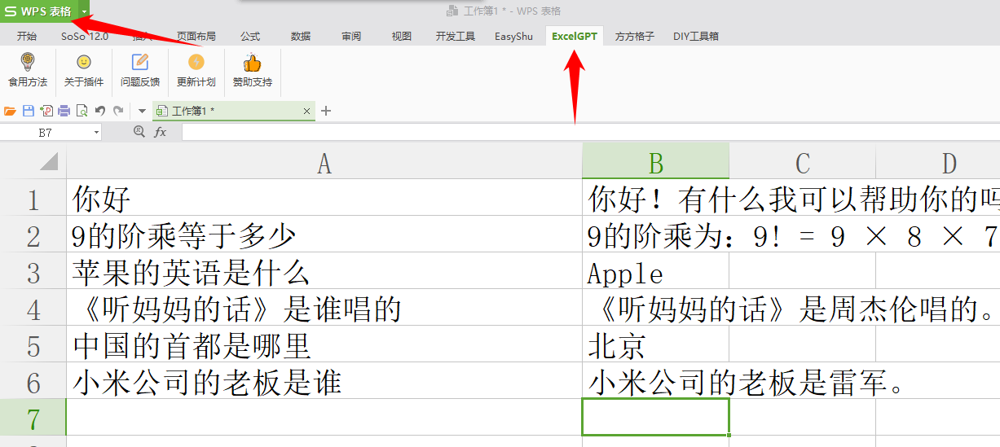
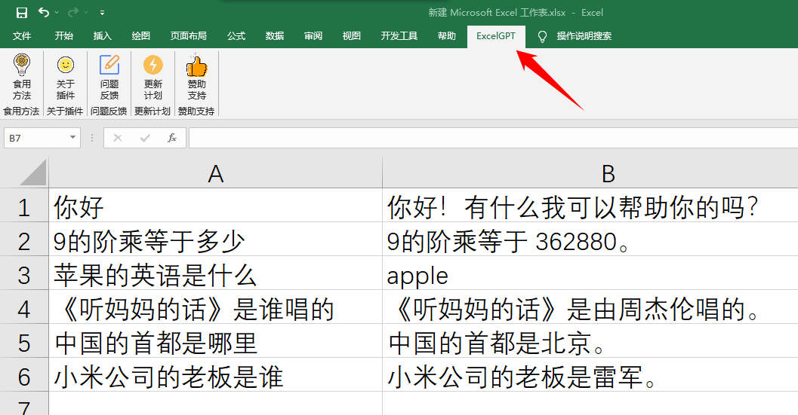

# ExcelGPT

本插件基于ExcelDna开发，无需复杂的VSTO和VBA环境，只需双击即可安装使用
**兼容Office Excel 和 WPS** （强烈建议使用金山公司开发的WPS，插件运行的更加完美！）

* WPS 插件界面展示

* Office Excel 插件界面展示

## 使用方法

单元格中输入=AI()即可食用

## 声明

本插件永久免费，禁止商用倒卖贩卖！！！

允许在B站、抖音、头条、快手、知乎、简书等平台分享扩散，但要署名开发者

不允许说是国外小哥开发的

## 更新计划

* ☑ ExcelGPT 初代版本实现函数调用chatgpt3.5接口 
* ExcelGPT pro 实现语音输入指令，打造办公界的贾维斯
* ExcelGPT pro max 接入GPT-4.0 实现AI绘制图表 
* ExcelGPT pro max Ultra 还没有想好叠什么buff，尽情期待

## 关于开源

由于担心不良商贩盗用，暂时不开源

## 问题反馈&功能更新建议

请在小众软件[插件发布页](https://meta.appinn.net/t/topic/43611)  反馈问题
或者在github提出Issues